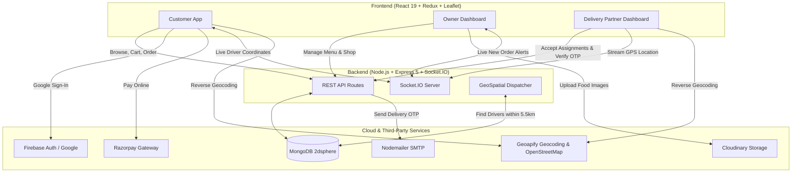

# 🍕 Vingo — Full-Stack Real-Time Food Delivery Platform

[](https://react.dev/)
[](https://nodejs.org/)
[](https://expressjs.com/)
[](https://www.mongodb.com/)
[](https://socket.io/)
[](https://tailwindcss.com/)
[](LICENSE)

> **Vingo** is a full-stack, multi-vendor food delivery web application built with the **MERN** stack (MongoDB, Express, React, Node.js). It powers a complete three-tier ecosystem connecting **Customers**, **Restaurant Owners**, and **Delivery Partners** with real-time order tracking, live geolocation mapping, Razorpay payment processing, and geospatial broadcast dispatching.

---

## 📌 Table of Contents

- [Overview](#-overview)
- [System Architecture & Flow](#-system-architecture--flow)
- [Key Features by Role](#-key-features-by-role)
  - [👤 Customer (User)](#-customer-user)
  - [🏪 Restaurant Owner](#-restaurant-owner)
  - [🚴 Delivery Partner](#-delivery-partner)
- [Technology Stack](#-technology-stack)
- [Project Directory Structure](#-project-directory-structure)
- [Database Models](#-database-models)
- [API Endpoints](#-api-endpoints)
- [Socket.IO Real-Time Events](#-socketio-real-time-events)
- [Getting Started & Installation](#-getting-started--installation)
  - [Prerequisites](#prerequisites)
  - [1. Clone Repository](#1-clone-repository)
  - [2. Backend Setup](#2-backend-setup)
  - [3. Frontend Setup](#3-frontend-setup)
- [Environment Variables](#-environment-variables)
- [Order Lifecycle Flow](#-order-lifecycle-flow)
- [Contributing & License](#-contributing--license)

---

## 🚀 Overview

Vingo provides an end-to-end food ordering experience tailored for multi-shop fulfillment:
- **Location-Aware Discovery:** Automatically detects user city and coordinates via Geoapify & browser geolocation to display nearby restaurants and menus.
- **Smart Cart & Split Orders:** Customers can bundle items across shops into a single order; the backend automatically distributes separate sub-orders to the respective restaurant owners.
- **Geospatial Delivery Dispatch:** When a restaurant marks food as ready (`out_of_delivery`), MongoDB `$near` 2dsphere queries locate available delivery drivers within a 5.5 km radius and dispatch assignment invitations via Socket.IO.
- **Live Courier Tracking:** Couriers continuously stream coordinates via WebSockets, rendering live bike/courier markers on interactive Leaflet maps for both the user and delivery dashboard.
- **Secure Handoff with OTP:** Orders are safely finalized with an encrypted 4-digit OTP sent via Nodemailer email and verified at the customer's doorstep.

---

## 🔄 System Architecture & Flow



---

## 🌟 Key Features by Role

### 👤 Customer (User)
- **Authentication:** Standard email/password signup, Firebase Google Sign-In pop-up integration, and password recovery via email OTP.
- **Location Auto-Detection:** Geocoding using Geoapify and OpenStreetMap reverse lookup to deliver city-specific restaurant feeds.
- **Interactive Menu & Filtering:** Category browsing (Pizza, Burgers, Biryani, Desserts, Shakes, North Indian, etc.) and instant live search.
- **Cart Management:** Redux Toolkit-backed reactive cart with quantity increments/decrements and minimum order delivery fee calculation.
- **Flexible Checkout:**
  - **Cash on Delivery (COD)**
  - **Online Payment:** Integrated Razorpay checkout with webhook-style signature verification.
- **Interactive Map Pinning:** Leaflet map component with draggable/re-centering address selection pin.
- **Real-Time Order Tracking:** View preparation status and watch delivery driver movement on a live Leaflet map.
- **Ratings & Reviews:** Submit star ratings for menu items directly after receiving orders.

---

### 🏪 Restaurant Owner
- **Shop Profile Management:** Register and edit shop profile, city, address, and high-resolution banner images stored on Cloudinary.
- **Menu Catalog Management:** Add, edit, or delete dishes with name, description, price, food category, and dish images.
- **Live Order Receiving:** Socket-driven real-time alert popups whenever a new order is received.
- **Order Pipeline Control:** Update order state through `pending` ➔ `preparing` ➔ `out_of_delivery` ➔ `delivered`.
- **Automated Dispatch Trigger:** Marking an order `out_of_delivery` automatically initiates geospatial queries to find and ping nearby delivery couriers.

---

### 🚴 Delivery Partner
- **Driver Geolocation Broadcast:** Periodic GPS coordinate syncing to Socket.IO whenever online.
- **Nearby Order Radar:** Broadcast feed of unassigned orders within ~5.5 km of pickup/customer radius.
- **Acceptance Mechanism:** First-to-accept lock preventing duplicate delivery assignments.
- **Turn-by-Turn Delivery Tracking:** Route overview on Leaflet showing shop pickup and customer destination.
- **Secure OTP Verification:** Delivery verification modal requiring the customer's secret 4-digit code to finalize order and mark as `delivered`.
- **Earnings & Analytics:** Recharts bar charts visualizing daily completed deliveries and revenue calculated based on per-order delivery rates.

---

## 💻 Technology Stack

### Frontend
| Layer | Technology |
| :--- | :--- |
| **Framework** | [React 19](https://react.dev/) + [Vite 7](https://vitejs.dev/) |
| **State Management** | [Redux Toolkit](https://redux-toolkit.js.org/) + React Redux |
| **Routing** | [React Router DOM v7](https://reactrouter.com/) |
| **Styling** | [Tailwind CSS v4](https://tailwindcss.com/) + `@tailwindcss/vite` |
| **Real-time Client** | [Socket.io-client](https://socket.io/) |
| **Maps & Geolocation** | [Leaflet](https://leafletjs.com/) + [React-Leaflet](https://react-leaflet.js.org/) + [Geoapify API](https://www.geoapify.com/) |
| **Data Visualization**| [Recharts](https://recharts.org/) (Delivery Partner Analytics) |
| **Authentication** | [Firebase Auth](https://firebase.google.com/) (Google OAuth) + Custom JWT |
| **HTTP Client** | [Axios](https://axios-http.com/) (Cookie-based credentials) |
| **UI Icons & Loaders** | `react-icons`, `react-spinners` |

### Backend
| Layer | Technology |
| :--- | :--- |
| **Runtime & Server** | [Node.js](https://nodejs.org/) + [Express.js 5](https://expressjs.com/) (ES Modules) |
| **Database** | [MongoDB](https://www.mongodb.com/) with [Mongoose 9](https://mongoosejs.com/) |
| **Geospatial Engine** | MongoDB `2dsphere` indexes (`$near` spatial queries) |
| **Real-Time Gateway** | [Socket.IO 4.8](https://socket.io/) (CORS with credentials) |
| **Authentication** | JSON Web Tokens (`jsonwebtoken`) + `bcryptjs` + HTTP-only `cookie-parser` |
| **Payments** | [Razorpay Node SDK](https://razorpay.com/) |
| **Media Storage** | [Cloudinary](https://cloudinary.com/) + [Multer](https://github.com/expressjs/multer) |
| **Mailing / OTP** | [Nodemailer](https://nodemailer.com/) (SMTP) |

---

## 📂 Project Directory Structure

```text
food-delievery-app/
├── backend/
│   ├── config/
│   │   ├── db.js                     # MongoDB connection setup
│   │   └── cloudinary.js             # Cloudinary configuration
│   ├── controllers/
│   │   ├── auth.controller.js        # Auth, OTP, Google login & password reset
│   │   ├── item.controller.js        # Menu item CRUD, ratings, city filters
│   │   ├── order.controller.js       # Checkout, Razorpay verify, dispatch logic, OTP
│   │   ├── shop.controller.js        # Restaurant creation & retrieval
│   │   └── user.controller.js        # Profile & live coordinates updates
│   ├── middlewares/
│   │   ├── isAuth.js                 # JWT verification middleware
│   │   └── multer.js                 # Multipart form image upload handler
│   ├── models/
│   │   ├── delievryAssingment.model.js# Dispatch & assignment schema
│   │   ├── item.model.js             # Menu item & review schema
│   │   ├── order.model.js            # Sub-order grouped multi-vendor schema
│   │   ├── shop.model.js             # Restaurant schema
│   │   └── user.model.js             # User & driver geospatial GeoJSON schema
│   ├── routes/
│   │   ├── auth.route.js             # /api/auth endpoints
│   │   ├── item.route.js             # /api/item endpoints
│   │   ├── order.route.js            # /api/order endpoints
│   │   ├── shop.route.js             # /api/shop endpoints
│   │   └── user.route.js             # /api/user endpoints
│   ├── util/
│   │   ├── generateToken.js          # JWT cookie signer
│   │   └── nodemailer.js             # Email templates for reset & delivery OTP
│   ├── env.sample.txt                # Sample environment variables
│   ├── server.js                     # Express app + HTTP Socket server initialization
│   ├── socket.js                     # Socket.io connection handlers & location broadcast
│   └── package.json
│
├── frontend/
│   ├── public/                       # Favicons and public assets
│   ├── src/
│   │   ├── assets/                   # Static images and icons
│   │   ├── components/               # Reusable UI components
│   │   │   ├── CartItemCard.jsx      # Cart items row
│   │   │   ├── CategoryCard.jsx      # Food category badges
│   │   │   ├── DeliveryboyDashboard.jsx # Courier management & charts
│   │   │   ├── DeliveryBoyTracking.jsx  # Interactive courier Leaflet map
│   │   │   ├── FoodCart.jsx          # Menu item card
│   │   │   ├── Nav.jsx               # Universal navbar with city search & cart
│   │   │   ├── OwnerDashboard.jsx    # Restaurant manager portal
│   │   │   ├── OwnerItemCard.jsx     # Menu card with edit/delete actions
│   │   │   ├── OwnerOrderCard.jsx    # Incoming orders card with status toggles
│   │   │   ├── UserDashboard.jsx     # Customer home discovery page
│   │   │   └── UserOrderCard.jsx     # Customer active orders with live tracking link
│   │   ├── hooks/                    # Custom React hooks (location, user, orders)
│   │   ├── pages/                    # Routed view pages
│   │   │   ├── AddItems.jsx          # Food item creation form
│   │   │   ├── CartPage.jsx          # Cart review
│   │   │   ├── CheckOut.jsx          # Map selection, address, COD/Razorpay
│   │   │   ├── CreateEditShop.jsx    # Restaurant details creation/update
│   │   │   ├── EditItem.jsx          # Menu item update
│   │   │   ├── Home.jsx              # Role-based dashboard dispatcher
│   │   │   ├── MyOrder.jsx           # Order history
│   │   │   ├── OrderPlaced.jsx       # Order success animation
│   │   │   ├── Shop.jsx              # Single restaurant public view
│   │   │   ├── SignIn.jsx            # User/Owner/Driver login
│   │   │   ├── SignUp.jsx            # Registration screen
│   │   │   ├── TrackOrderPage.jsx    # Real-time Leaflet delivery tracking
│   │   │   └── forgotPassword.jsx    # OTP reset workflow
│   │   ├── redux/                    # Redux Toolkit store, userSlice, ownerSlice, mapSlice
│   │   ├── App.jsx                   # Route configuration & global Socket instance
│   │   ├── category.js               # Preset food categories data
│   │   └── main.jsx                  # Root React mount
│   ├── vite.config.js
│   └── package.json
│
└── README.md
```

---

## 🗄️ Database Models

### 1. `User` Model
- `fullName`, `email`, `password`, `mobile`, `role` (`user` | `owner` | `deliveryBoy`).
- `resetOtp`, `isOtpVerified`, `otpExpires`.
- `socketId`, `isOnline`.
- `location`: GeoJSON Point (`coordinates: [longitude, latitude]`) with **`2dsphere` index** for geospatial radius queries.

### 2. `Shop` Model
- `name`, `image` (Cloudinary URL), `owner` (Ref to User), `city`, `state`, `address`.
- `items`: Array of references to Item model.

### 3. `Item` Model
- `name`, `description`, `image`, `price`, `category`, `foodType` (`veg` | `non-veg`).
- `shop` (Ref to Shop), `rating`: Array of rating objects with user references.

### 4. `Order` Model
- `user`: Ref to customer.
- `paymentMethod`: `cod` | `online`.
- `payment`: Boolean.
- `razorpayOrderId`, `razorpayPaymentId`.
- `deliveryAddress`: `{ text, latitude, longitude }`.
- `totalAmount`: Aggregated cost.
- `shopOrders`: Array of sub-orders partitioned by restaurant:
  - `shop`, `owner`, `subTotal`, `shopOrderItem` list.
  - `status`: `pending` | `preparing` | `out_of_delivery` | `delivered`.
  - `assignment`: Ref to `DeliveryAssignment`.
  - `assignedDeliveryBoy`: Ref to courier User.
  - `deliveryOtp`, `otpExpires`, `deliveredAt`.

### 5. `DeliveryAssignment` Model
- `order`, `shop`, `shopOrderId`.
- `broadcastedTo`: Array of candidate courier user IDs.
- `assignedTo`: Courier who claimed the delivery.
- `status`: `broadcasted` | `assigned` | `completed`.
- `acceptedAt`: Timestamp.

---

## 🔌 API Endpoints

### 🔐 Authentication (`/api/auth`)
| Method | Endpoint | Description |
| :--- | :--- | :--- |
| `POST` | `/signup` | Register new user/owner/delivery partner |
| `POST` | `/signin` | Login & set HTTP-only JWT cookie |
| `GET` | `/signout` | Clear auth cookie |
| `POST` | `/google-auth` | Register / link via Firebase Google credentials |
| `POST` | `/google-auth-in`| Login with Firebase Google credentials |
| `POST` | `/send-otp` | Dispatch password reset OTP via email |
| `POST` | `/verify-otp` | Verify OTP code |
| `POST` | `/reset-password`| Update account password |

### 🍔 Menu & Items (`/api/item`)
| Method | Endpoint | Description |
| :--- | :--- | :--- |
| `POST` | `/add-item` | Add dish with image upload (*Auth required*) |
| `POST` | `/edit-item/:itemId` | Update dish details and image |
| `GET` | `/get-by-id/:itemId` | Fetch single dish |
| `GET` | `/search?query=&city=` | Search food items filtered by city |
| `GET` | `/get-shop-items/:shopId` | Fetch all dishes for a specific restaurant |
| `GET` | `/get-by-city/:city` | Get all items available in a given city |
| `GET` | `/remove/:itemId` | Delete a food item |
| `POST` | `/rating` | Rate and review an item |

### 🏬 Restaurant (`/api/shop`)
| Method | Endpoint | Description |
| :--- | :--- | :--- |
| `POST` | `/create-edit` | Create or update restaurant profile |
| `GET` | `/get-my` | Fetch current owner's restaurant profile |
| `GET` | `/get-shops/:city` | Retrieve all restaurants in a selected city |

### 📦 Orders & Delivery (`/api/order`)
| Method | Endpoint | Description |
| :--- | :--- | :--- |
| `POST` | `/place-order` | Place order (COD or initialize Razorpay order) |
| `POST` | `/verify-payment` | Validate Razorpay signature and capture payment |
| `GET` | `/my-orders` | Fetch orders for customer or restaurant owner |
| `POST` | `/update-status/:orderId/:shopId` | Update food prep status & trigger driver dispatch |
| `GET` | `/get-assignments` | Fetch broadcasted delivery jobs for couriers |
| `GET` | `/accept-order/:assignmentId`| Lock and accept delivery order |
| `GET` | `/get-current-order` | Fetch driver's active delivery assignment |
| `GET` | `/get-order-by-id/:orderId` | Get detailed order info for live tracking |
| `POST` | `/send-delivery-order` | Generate and email delivery OTP to customer |
| `POST` | `/verify-delivery-order` | Validate delivery OTP and complete delivery |
| `GET` | `/get-today-deliveries` | Driver analytics & completed delivery stats |

---

## ⚡ Socket.IO Real-Time Events

| Event Name | Direction | Payload | Description |
| :--- | :--- | :--- | :--- |
| `identity` | Client ➔ Server | `{ userId }` | Binds current user's socket to their DB record and sets `isOnline: true` |
| `updateLocation` | Driver ➔ Server | `{ latitude, longitude, userId }` | Updates courier's `location` coordinates in DB |
| `updateDeliveryLocation` | Server ➔ Broadcast | `{ delievryBoyId, latitude, longitude }` | Streams live courier coordinates to listening tracking pages |
| `newOrder` | Server ➔ Owner | Order object | Real-time notification delivered to restaurant owner's socket room |
| `newAssignment` | Server ➔ Driver | Assignment object | Alerts candidate delivery partners within 5.5 km of a ready order |

---

## 🛠️ Getting Started & Installation

### Prerequisites
- [Node.js](https://nodejs.org/) (v18.x or later recommended)
- [MongoDB Atlas](https://www.mongodb.com/cloud/atlas) or a local MongoDB server instance
- [Cloudinary](https://cloudinary.com/) account for image storage
- [Razorpay](https://razorpay.com/) test API keys
- [Geoapify](https://www.geoapify.com/) API key for geocoding

### 1. Clone Repository
```bash
git clone https://github.com/samir0445/food-delivery-site.git
cd food-delivery-site
```

### 2. Backend Setup
```bash
cd backend
npm install
```

Create a `.env` file in the `backend/` directory:
```env
PORT=3000
MONGODB=your_mongodb_connection_uri
JWT_SECRET=your_jwt_secret_key

# Nodemailer SMTP
EMAIL=your_email@gmail.com
SMTP_USER=your_smtp_user_or_email
SMTP_PASS=your_smtp_app_password

# Cloudinary
CLOUDINARY_CLOUD_NAME=your_cloudinary_cloud_name
CLOUDINARY_API_KEY=your_cloudinary_api_key
CLOUDINARY_SECRET_KEY=your_cloudinary_secret_key

# Razorpay
RAZORPAY_KEY=your_razorpay_key_id
RAZORPAY_SECRET_KEY=your_razorpay_key_secret
```

Start the backend server:
```bash
npm run dev
```

### 3. Frontend Setup
```bash
cd ../frontend
npm install
```

Create a `.env` file in the `frontend/` directory:
```env
VITE_GEOAPI=your_geoapify_api_key
```

Configure Firebase in `frontend/firebase.js` if using Google OAuth:
```javascript
import { initializeApp } from "firebase/app";
import { getAuth } from "firebase/auth";

const firebaseConfig = {
  apiKey: "YOUR_API_KEY",
  authDomain: "YOUR_AUTH_DOMAIN",
  projectId: "YOUR_PROJECT_ID",
  storageBucket: "YOUR_STORAGE_BUCKET",
  messagingSenderId: "YOUR_MESSAGING_SENDER_ID",
  appId: "YOUR_APP_ID"
};

const app = initializeApp(firebaseConfig);
export const auth = getAuth(app);
```

Start the frontend development server:
```bash
npm run dev
```

Visit the application in your browser at `http://localhost:5173`.

---

## 📦 Order Lifecycle Flow

```text
1. Customer adds items to Cart (items partitioned by Restaurant Shop)
2. Customer selects Location (Map / Geocode) & Payment (COD or Razorpay)
3. Order Created:
   └── Socket event 'newOrder' fires to corresponding Shop Owners
4. Shop Owner accepts and prepares order (Status: 'preparing')
5. Shop Owner marks order as 'out_of_delivery':
   └── MongoDB $near 2dsphere searches for active drivers within 5.5 km
   └── Socket broadcast 'newAssignment' pings nearby drivers
6. First delivery driver accepts assignment:
   └── Driver status locks; route renders on Leaflet map
7. Driver arrives at customer destination:
   └── Driver triggers OTP request via Nodemailer email to customer
8. Driver enters Customer's 4-digit OTP:
   └── Verification succeeds ➔ Order marked 'delivered'
   └── Driver earnings updated
```

---

## 🤝 Contributing

Contributions, issues, and feature requests are welcome!
Feel free to open an issue or submit a pull request:
1. Fork the Project
2. Create your Feature Branch (`git checkout -b feature/AmazingFeature`)
3. Commit your Changes (`git commit -m 'Add some AmazingFeature'`)
4. Push to the Branch (`git push origin feature/AmazingFeature`)
5. Open a Pull Request

---

## 📄 License

This project is licensed under the [ISC License](LICENSE).
